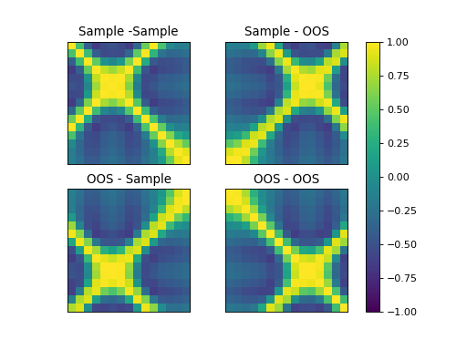
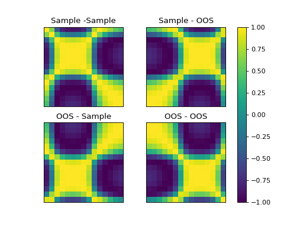

# Kerch
[](https://pypi.org/project/kerch/)
[](https://pypi.org/project/kerch/)
[](https://www.gnu.org/licenses/lgpl-3.0.html)
[](https://kerch.readthedocs.io/en/latest/?badge=latest)
[](https://github.com/hdeplaen/kerch)
[](https://github.com/hdeplaen/kerch/commits/master/)


Kerch is a Python package meant for various kernel methods, and in particular Deep Restricted Kernel Machines. You can natively perform SVMs, LS-SVMs, (K)PCA with various kernels, automatic centering, out-of-sample, etc.

The package is built upon PyTorch and supports GPU acceleration.

<!-- toc -->

* [Examples](#examples)
  - [LS-SVM](#training-and-plotting-an-ls-svm)
* [Installation](#installation)
  - [PIP](#pip)
  - [From source](#from-source)
* [Acknowledgements](#acknowledgements)
* [Resources](#resources)
* [License](#license)

## Examples


### Training and plotting an LS-SVM

This is done by first instantiating a model, setting its dataset, searching for the hyperparameters, fitting with those 
parameters and plotting. The implementation can be found [here](research/misc/lssvm-tuning.py).

```python
import kerch                                        # importation is fast as the modules are only loaded when called
mdl = kerch.model.LSSVM(type="rbf",                 # kernel name
                     representation="dual")         # initiate model
mdl.set_data_prop(data=data,                        # value
                  labels=labels,                    # corresponding labels
                  proportions=[1, 0, 0])            # initiate data
mdl.hyperopt({"gamma", "sigma"},                    # define which parameters to tune
             max_evals=500,                         # define how many trials
             k=10)                                  # 10-fold cross-validation
mdl.fit()                                           # fit the optimal parameters found
kerch.plot.plot_model(mdl)                          # plot the model using the built-in method

```



### Out-of-sample kernels with normalization and centering
The factory class alows for the fast instantiation of various implemented kernels. Centering and normalization are 
options to choose from and the out-of-sample will also satisfy these properties, based on statistics relative ti the 
sample. You can easily use numpy arrays ore even python builtins such as `range()`. An implementation can be found 
[here](examples/kernel.py)

```python
sample = np.sin(np.arange(0, 15) / np.pi) + .1
oos = np.sin(np.arange(15, 30) / np.pi) + .1

k = kerch.kernel.factory(type="polynomial", sample=sample, center=True, normalize=True)

k.K  # = k1.k1()
k.k1(y=oos)
k.k1(x=oos)
k.k1(x=oos, y=oos)

```




## Installation
As for now, there are two ways to install the package.

### PIP
Using pip, it suffices to run `pip install kerch`. Just rerun this command with the suffix `--upgrade` to upgrade the package to its newest version.

### From source
You can also install the package directly from the GitHub repository.
```
git clone --recursive https://github.com/hdeplaen/kerch
cd kerch
pip install -e .
```

## Resources

* [Documentation](https://hdeplaen.github.io/kerch/)
* [E-DUALITY](https://www.esat.kuleuven.be/stadius/E/): ERC Adv. Grant website.
* [ESAT-STADIUS](https://www.esat.kuleuven.be/stadius/): KU Leuven, Department of Electrical Engineering (ESAT), STADIUS Center for
    Dynamical Systems, Signal Processing and Data Analytics.

## Contributors
The contributors and acknowledgements can be found in the [CONRIBUTORS](CONTRIBUTORS) file.

## License
Kerch has a LGPL-3.0 license, as found in the [LICENSE](LICENSE) file.
